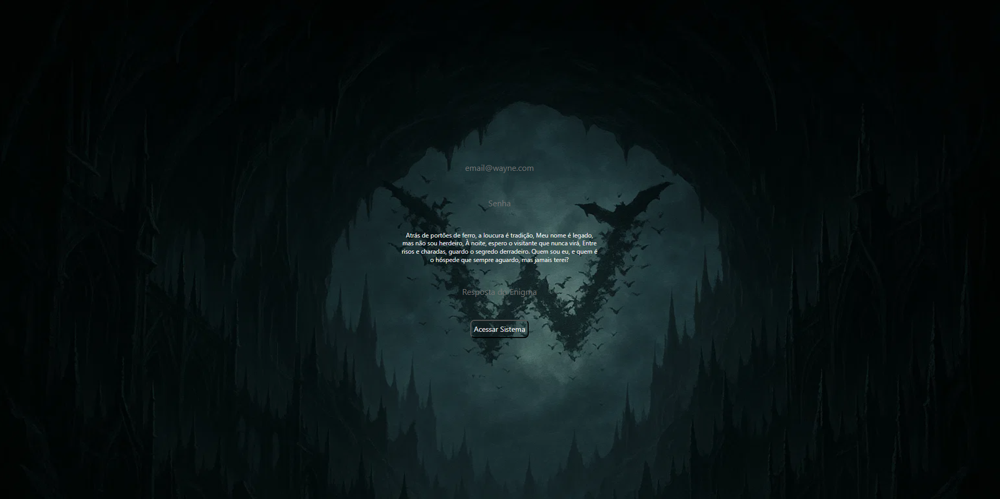

<p align="center">
  
</p>

<h1 align="center"> I Am The Night — Wayne Industries Secure Access System</h1>

<p align="center">
  Sistema front-end temático inspirado no universo Batman, desenvolvido para simular uma tela de autenticação corporativa das Indústrias Wayne.
</p>

<p align="center">
  
  
  
</p>

---

## 📌 Sobre o Projeto

O **Indústrias Wayne — Painel de Acesso** é uma aplicação web desenvolvida com foco em **interface, experiência do usuário, validação de formulário e interatividade com JavaScript e criptografia PHP**.

O projeto simula um sistema de login corporativo das Indústrias Wayne, trazendo uma identidade visual escura, sofisticada e tecnológica. A proposta foi criar uma experiência visual imersiva, utilizando conceitos modernos de front-end como **glass morphism**, animações, feedback visual e responsividade.

Este projeto foi desenvolvido como parte do meu portfólio para demonstrar domínio em estruturação de páginas, organização de arquivos, estilização avançada e manipulação do DOM com JavaScript puro.

---

## 🎯 Objetivo do Projeto

Criar uma interface de login temática, funcional e visualmente atrativa, aplicando boas práticas de desenvolvimento front-end.

O projeto demonstra habilidades em:

- Estruturação semântica com HTML5
- Estilização moderna com CSS3
- Manipulação de eventos com JavaScript
- Validação de formulários
- Organização de arquitetura de pastas
- Responsividade para diferentes dispositivos
- Criação de experiência visual para o usuário
- Desenvolvimento de projeto com foco em apresentação para portfólio

---

## 🖥️ Preview do Projeto

<p align="center">
  
</p>

---

## 🔐 Credenciais de Demonstração

Para acessar o sistema, utilize as credenciais abaixo:

```txt
Email: BruceThomas@Wayne.com
Senha: Jsontoddy
Resposta do enigma: morcego
```

---

## 🚀 Funcionalidades

- Tela de login temática das Indústrias Wayne
- Validação de email, senha e resposta do enigma
- Feedback visual para campos inválidos
- Mensagens de sucesso e erro
- Animação de loading durante o acesso
- Redirecionamento para o dashboard após login
- Efeito visual de glass morphism
- Animações suaves na interface
- Easter egg temático ao digitar `batman`
- Layout responsivo para desktop, tablet e mobile
- Estrutura preparada para futuras integrações com backend

---

## 🎨 Destaques de Interface

A interface foi construída com foco em uma experiência visual imersiva e profissional, explorando uma estética inspirada em sistemas corporativos de segurança.

Principais elementos visuais:

- Paleta de cores escura com detalhes em dourado e cinza
- Formulário com transparência e efeito de vidro
- Background temático
- Animações suaves de entrada e interação
- Efeitos de hover em botões e campos
- Texto do enigma com efeito de “hackeamento”
- Layout limpo, centralizado e objetivo

---

## 🛠️ Tecnologias Utilizadas

<p align="left">
  
  
  
  
  
  
</p>

### Tecnologias e conceitos aplicados

- **HTML5** — Estrutura da aplicação
- **CSS3** — Estilização, animações e responsividade
- **JavaScript Vanilla** — Validações, eventos e interações
- **Bootstrap 5** — Apoio na construção de componentes
- **Google Fonts** — Tipografia personalizada
- **Git e GitHub** — Versionamento e hospedagem do código
- **Flexbox e CSS Grid** — Organização visual dos elementos
- **Mobile First** — Adaptação para diferentes dispositivos

---

## 📁 Arquitetura de Pastas

```txt
Projeto_Wayne/
├── .vscode/
│   └── Configurações do ambiente de desenvolvimento
│
├── assets/
│   └── Imagens, banners, backgrounds e arquivos visuais
│
├── css/
│   └── Arquivos de estilização da aplicação
│
├── Dashboren Wayne/
│   └── Tela de dashboard acessada após o login
│
├── js/
│   └── Scripts responsáveis pelas validações e interações
│
├── php/
│   └── Estrutura reservada para futuras integrações com backend
│
├── .gitignore
│   └── Arquivos e pastas ignorados pelo Git
│
├── index.html
│   └── Página principal de login
│
├── modelo.html
│   └── Página modelo auxiliar do projeto
│
└── README.md
    └── Documentação do projeto
```

---

## ⚙️ Como Executar o Projeto

### 1. Clone o repositório

```bash
git clone https://github.com/DevWizardMarcos/Projeto_Wayne.git
```

### 2. Acesse a pasta do projeto

```bash
cd Projeto_Wayne
```

### 3. Abra o projeto no navegador

Você pode abrir diretamente o arquivo:

```txt
index.html
```

Ou utilizar a extensão **Live Server** no VS Code para uma melhor experiência de desenvolvimento.

---

## 🧪 Fluxo de Uso

1. Acesse a página inicial do projeto.
2. Informe o email de demonstração.
3. Digite a senha correta.
4. Responda o enigma com `morcego`.
5. Clique no botão de acesso.
6. Aguarde a animação de loading.
7. O sistema redireciona para o dashboard.

---

## 💡 Aprendizados Desenvolvidos

Durante o desenvolvimento deste projeto, foram praticados conceitos importantes para aplicações front-end:

- Organização de projeto web
- Construção de layout responsivo
- Manipulação do DOM
- Validação de campos com JavaScript
- Controle de eventos
- Feedback visual para o usuário
- Aplicação de animações com CSS
- Separação de responsabilidades entre HTML, CSS e JS
- Documentação profissional para GitHub

---

## 📌 Melhorias Futuras

- Integração com backend real
- Autenticação com banco de dados
- Criptografia de senha
- Sistema de recuperação de senha
- Dashboard com dados dinâmicos
- Área administrativa completa
- Integração com API externa
- Deploy online
- Melhorias de acessibilidade
- Refatoração do JavaScript em módulos

---

## 👨‍💻 Autor

Desenvolvido por **Marcos Simões**.

<p>
  <a href="https://github.com/DevWizardMarcos" target="_blank">
    
  </a>
  <a href="https://www.linkedin.com/in/marcos-simoes-ms/" target="_blank">
    
  </a>
</p>

---

## 📄 Licença

Este projeto foi desenvolvido para fins educacionais e de portfólio.

---

<p align="center">
  “I am vengeance. I am the night. I am Batman.” 🦇
</p>
